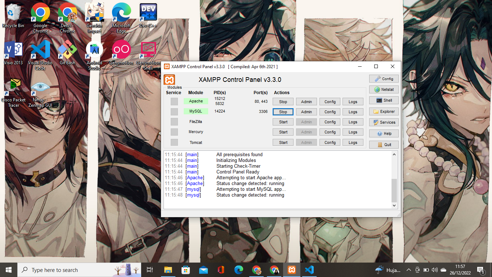
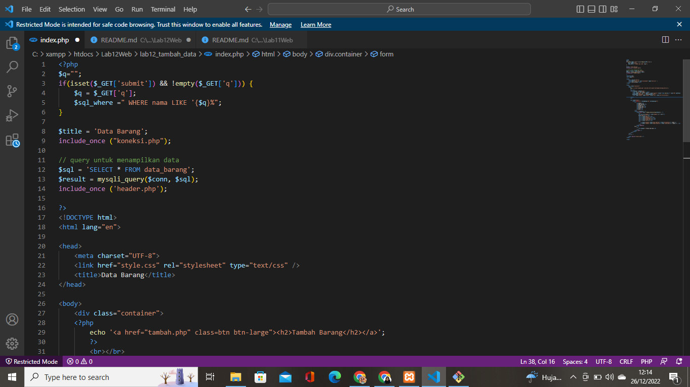
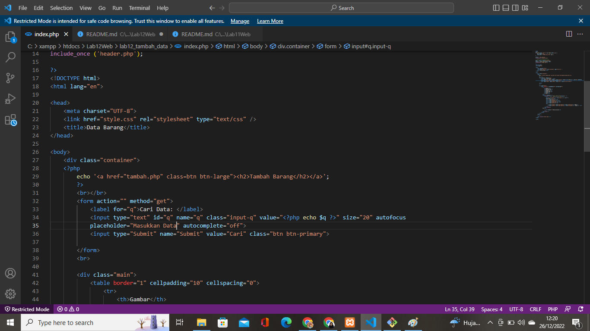
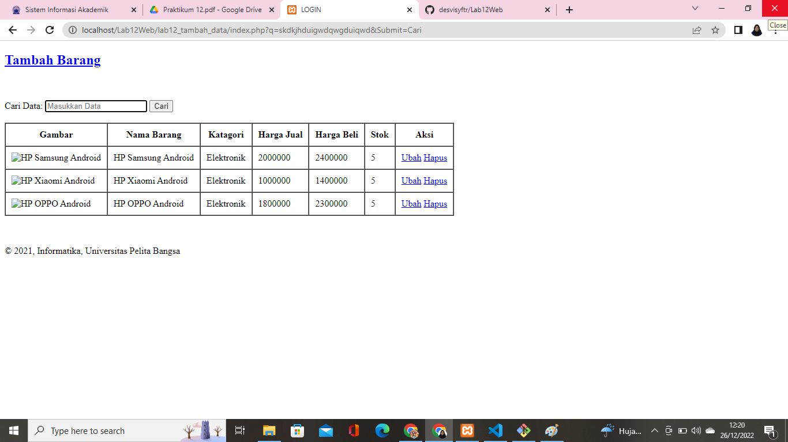

# Lab12Web
## Cari Data

### Menjalankan Web server 
Seperti biasa kita harus menjalankan web server yang ada di XAMPP control apache dan MySQL begini tampilannya:

### Membuat Pencarian Data
Setelah menjalankan web server, kita langsung saja masuk ke file index.php dan sisipkan kode tersebut sebelum table data dan sesudah tombol tambah data. Begini tampilannya:

### Hasil
Begini lah hasil dari kode tersebut:

